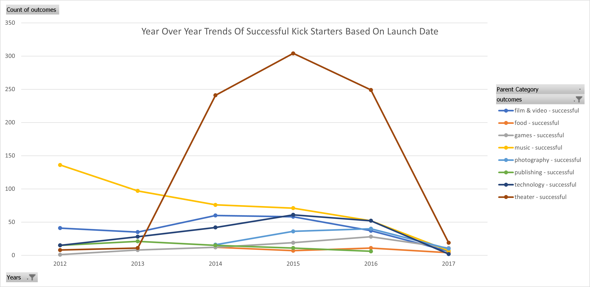
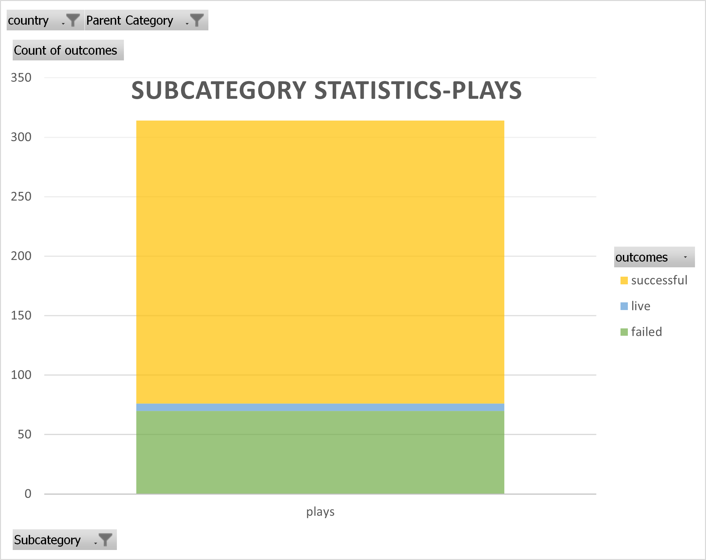
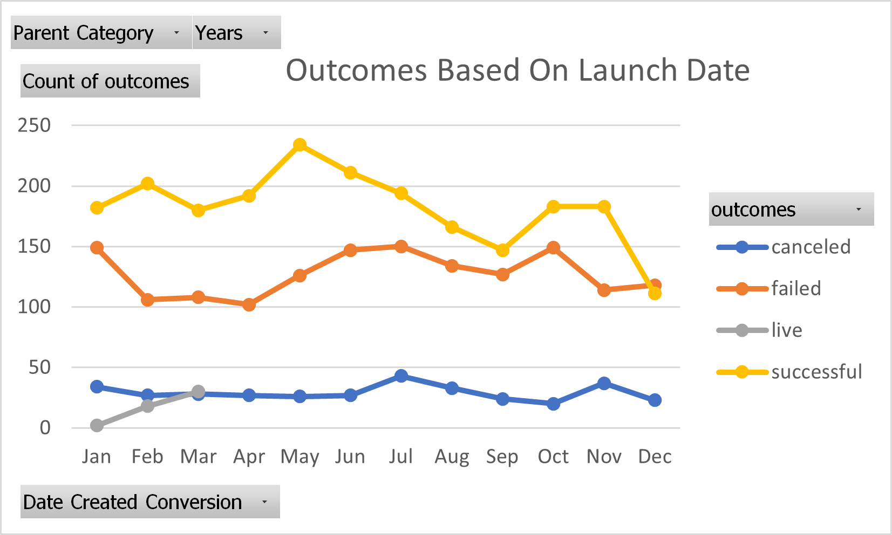
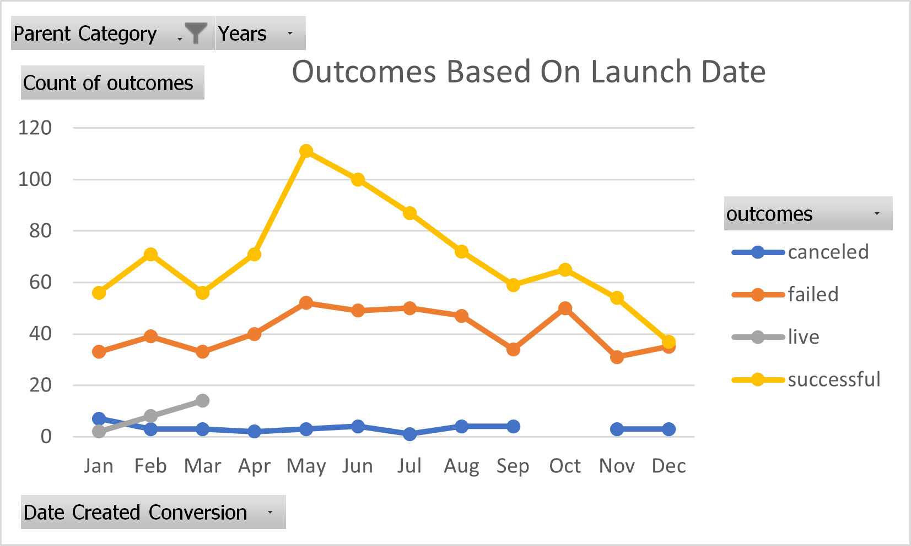
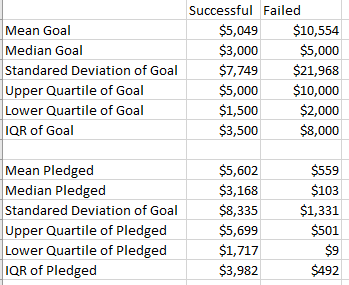

# An Analysis of Kickstarter Campaigns.

## Playwrite Louise would like to start a crowd funding campaign to fund her play Fever to raise $10000

## Louise would like us to analyze data to determine likelihood of success or to identify potential barriers to success. 

## Analysis and Challenges
There are many things to consider when starting a Kickstarter campaign.
*The strength of the economy
*Trends in the industry that may lead one category to be in favor over another during Kickstarter campaigns
*Goals and expectations of those launching the Kickstarter campaigns

### The Kickstarter Trend by industry
Based on the year over year successful launch chart below, you can see the health of Kickstarters for each category year over year.  By looking at the data one can see:
* Music and publishing Kickstarters are showing a steady downward trend
* Film, video and technology kick starter tend to show healthier success rates than games and food
* Theater Kickstarts show very strong activity year over year,especially during years 2014 - 2016  This is information is favorable for a launch of a theater kickstart campaign.  Especially for a play as the next two plots show. 
* 
* 

### Analysis of Outcomes Based on Launch Date
From date ranges provided in the spreadsheet, 2009-2017, Kickstarters have proven to be a very popular method to generate money to fund projects.  Over 4000 Kickstarter campaigns were iniated over this time frame.  By analyzing Kickstarter data for all categoriesk, May appears to be the best time to launch a kickstart campain.

To provide further clarity we can continue to drill further into the Kickstarter data by providing information based solely on the category of interest which is funding for Theater.  Based on this information, one can see that it is more evident that the month of May is the best month to launch a successful Kickstart campaign. Please see attached Image.

### Analysis of Outcomes Based on Goals
As mentioned previoulsy, goals and expectations play an important role with regards to the success of a Kickstart campaign. The goal should be set at a value that market is willing and able to support. Setting a goal that exceeds the limit of the market will almost ensure failure and may even deter donations to fund.  By reviewing the table below of successful and failed theater/play kickstarters, the Mean and Median goals of successful campaigns were almost less that half of the Mean and Median of the failed campaign goals.  One step further, the failed campaign pledges would have not met the goals of the levels set by the successful campaigns.  The reasoning of why the failed campaigns pleadges were so low would need further investigation.  By reviewing the Goals and Pledges of the successful campaign the mean and upper and lower quartile numbers were similar while the failed campaigns goals and pledges were significantly lower than the upper and lower quartiles.

### Challenges and Difficulties Encountered
Biggest challenge that I found was to drill down the data in the most efficient form, provide concise and accurate results that would help the client make a decision and not confuse them. Scope creep was also a problem as I found myself going deeper and deeper into the data trying to get to the very minute granular level.  Like an artist creating a painting, knowing when to stop is key.

## Results

- What are two conclusions you can draw about the Outcomes based on Launch Date?
- First Conclusion is that based on the failed outcome launch dates, there is only a moderate change over time.  The months of February, March and April show the lowest failure rates but by performing a straight line fit for both the successful and failed campaigns, the success rates are higher at the beginning of the year and the failure rates are lower.  With the exception of May however, the lines tend to converge as the months pass by with the success rates droppig and failed rates rising.  
- This leads us to our second conclusion.  May is interesting as it does appear to be the month with the most successful kickstart campaigns and displays the largest separation between successful and failed campaigns. 

- What can you conclude about the Outcomes based on Goals?
- Goals highlighted the fact that most kickstarters that failed because they set goals that were not realistic.  Perhaps their chances of success would have improved if they hired an analyst from the UCF bootcamp to review the data and determine the proper environment and conditions to launch a kickstarter campaign.  Successful campaigns had lower median and mean goals and the average pledge was much higher than that of the failed campaign.  More analysis would have to be done to determine why the failed campaign pledges were significantly lower on a per pledge basis than compared to the successful campaign.  Speculation could be that when a goal is close to being reached, people are more apt to contribute more money to help reach that goal.  However, when the goal is so far from being accomplished, people do not feel compelled to contribute.

- What are some limitations of this dataset?
- It doesn't take into external factors such as the economy both local and global. One can look at the data and make inferences about the state of the economy but, there would not be anything from this data set to substantiate it.  Perhaps another limitation would be the granularity of the data set especially when it comes to plays.  It would also be helpful to know which types of plays were successful, i.e. comdies, tragedies, drama etc.  This would allow the Louise to konw whether or not FEVER was in favor, meaning the type of play people are wanting to see or fund.

- What are some other possible tables and/or graphs that we could create?
- I did create additional tables that were posted above.  One in particular was to see if there was a postive or negative successful campaign trend for the various industries year over year.  This information I felt, could help shape expectations of whether the market was favoring theater kickstarters or falling out of favor.  The data appeared to show that it was still in favor.  Another table to create would have been one that would have shown more information surrounding the month of May.  What was the percentage of failure vs successful kickstarters in May, plus overlay the goal and pledge levels for that particualr month compared to other months.
